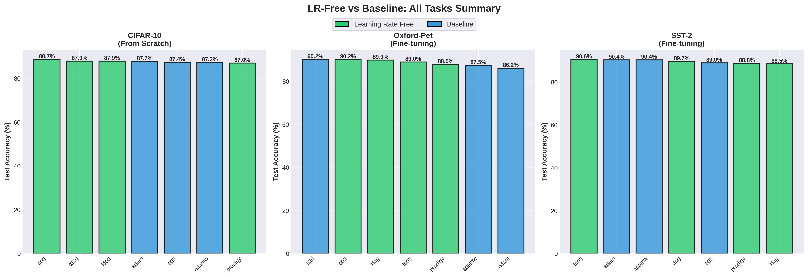

# Learning Rate Free Optimization: Empirical Evaluation

An empirical study comparing **Learning Rate Free optimizers** (DOG, L-DOG, T-DOG, Prodigy) against traditional **baseline optimizers** (SGD, Adam, AdamW) across diverse machine learning tasks.

## Overview

This project evaluates parameter-free optimization methods that eliminate the need for learning rate tuning—one of the most time-consuming aspects of deep learning. We compare these methods against traditional optimizers with multiple learning rate configurations to assess their practical effectiveness.


## Optimizers Under Test

### Learning Rate Free Optimizers
These optimizers automatically adapt their learning rates without manual tuning:
- **DOG** (Distance Over Gradients) - Parameter-free convex optimization
- **L-DOG** (Layerwise DOG) - Layer-specific adaptation
- **T-DOG** (Transformed DOG) - Enhanced transformation variant
- **Prodigy** - Adaptive learning rate method


### Baseline Optimizers
Traditional optimizers requiring learning rate search:
- **SGD** with Momentum: Tested with LR ∈ {1.0, 0.5, 0.1, 0.01, 0.001}
- **Adam**: Tested with LR ∈ {0.01, 0.005, 0.001, 0.0001, 0.00001}
- **AdamW**: Tested with LR ∈ {0.01, 0.005, 0.001, 0.0001, 0.00001}

## Experimental Tasks

### 1. CIFAR-10 (Image Classification)
- **Model**: ResNet-20 trained from scratch
- **Dataset**: 50,000 training images, 10,000 test images (10 classes)
- **Training**: 50 epochs, batch size 128
- **Scenario**: From-scratch training on small-scale vision task

### 2. Oxford-IIIT Pet (Fine-tuning)
- **Model**: Pre-trained ViT-Tiny (Vision Transformer)
- **Dataset**: 3,680 training images, 3,669 test images (37 pet breeds)
- **Training**: 10 epochs, batch size 32
- **Scenario**: Fine-tuning pre-trained vision model

### 3. SST-2 (Sentiment Analysis)
- **Model**: Pre-trained DistilBERT
- **Dataset**: 67,349 training samples, 872 test samples (binary sentiment)
- **Training**: 5 epochs, batch size 32
- **Scenario**: Fine-tuning pre-trained language model

## Project Structure

```
new/
├── README.md                          # This file
├── requirements.txt                   # Python dependencies
│
├── src/                              # Source code
│   ├── main.py                       # Main training entry point
│   ├── config.py                     # Configuration management
│   ├── trainer.py                    # Training loop
│   ├── utils.py                      # Utility functions
│   ├── data/                         # Data loaders
│   │   ├── vision_data.py           # CIFAR-10, Oxford-Pet loaders
│   │   └── nlp_data.py              # SST-2 loader
│   ├── models/                       # Model definitions
│   │   ├── vision_models.py         # ResNet-20, ViT-Tiny
│   │   └── nlp_models.py            # DistilBERT
│   └── optimizers/                   # Optimizer factory
│       ├── factory.py               # Optimizer creation
│       └── dog.py                   # DOG variants implementation
││
├── experiments/                      # Experiment scripts
│   ├── run_cifar10.sh               # Run CIFAR-10 experiments
│   ├── run_oxford_pet.sh            # Run Oxford-Pet experiments
│   ├── run_sst2.sh                  # Run SST-2 experiments
│   └── run_all_experiments.sh       # Run all experiments
│
├── results/                          # Experiment results (JSON files)
│
└── analysis/                         # Analysis scripts
    ├── analyze_best_results.py      # Extract best results
    ├── analyze_lr_free_only.py      # LR-Free vs Baseline analysis
    ├── plot_lr_free_only.py         # Generate comparison plots
    └── plot_final_report.py         # Generate detailed report plots
```

## Environment Setup

### Requirements
- Python 3.8+
- PyTorch 2.0+
- CUDA-capable GPU (recommended)

### Installation

```bash
# Clone the repository
cd /path/to/your/directory

# Install dependencies
pip install -r requirements.txt
```

### Dependencies
- PyTorch & torchvision
- Transformers (Hugging Face)
- Datasets (Hugging Face)
- timm (PyTorch Image Models)
- prodigyopt
- matplotlib
- numpy

## Running Experiments

**All commands should be executed from the project root directory.**

Run experiments for all three tasks:

```bash
# CIFAR-10: 13 optimizer configurations
bash experiments/run_cifar10.sh

# Oxford-Pet: 13 optimizer configurations
bash experiments/run_oxford_pet.sh

# SST-2: 13 optimizer configurations
bash experiments/run_sst2.sh

# Or run all at once (39 total experiments)
bash experiments/run_all_experiments.sh
```

**Results**: JSON files saved to `results/` directory with format:
- `{task}_{optimizer}_lr{value}.json`


## Analyzing Results

### 1. Extract Best Results

Extract the best performing configuration for each optimizer:

```bash
python analysis/analyze_best_results.py
```

**Output**: `best_results_summary.json` - Summary of best test accuracy for each task and optimizer.

### 2. LR-Free vs Baseline Comparison

Generate detailed comparison between parameter-free and baseline optimizers:

```bash
python analysis/analyze_lr_free_only.py
```

**Output**:
- Console: Text summary of results
- `best_results_lr_free_only.json`: Best results per category

### 3. Generate Visualizations

#### Comprehensive Comparison Plots

```bash
python analysis/plot_lr_free_only.py
```

**Output**: `final_plots/` directory containing:
1. LR sensitivity analysis for each task
2. Best optimizer comparison (bar charts)
3. Training curves comparison
4. Training time analysis

#### Detailed Report Plots

```bash
python analysis/plot_final_report.py
```
**Output**: `final_report/` directory containing 18 plots (6 per task):
1. SGD learning curves (all LRs)
2. Test accuracy comparison (bar chart)
3. Adam learning curves (all LRs)
4. AdamW learning curves (all LRs)
5. Best baseline vs LR-Free curves
6. Training time comparison



## Key Findings

1. **Competitive Performance**: LR-Free optimizers win on 2 out of 3 tasks without any tuning
2. **Time Efficiency**: Baseline optimizers require testing multiple LRs; LR-Free methods need only one run
3. **Practical Advantage**: No hyperparameter search required, especially valuable for:
   - Limited computational resources
   - New domains without established LR ranges
   - Rapid prototyping and experimentation

## References

- **DOG**: "Distance over Gradients: Fast Parameter-Free Online Convex Optimization" (Ivgi et al., 2023)
- **Prodigy**: [prodigyopt library](https://github.com/konstmish/prodigy)